# 证券知识汇总

## 参考网站
[证监会](http://www.csrc.gov.cn/csrc/c106256/c1653953/content.shtml, "证监会官网")

[中国登记结算公司](http://www.chinaclear.cn)

## 证券系统专业名词
### 参与者角色
交易所：投资者进行金融（股票、债券、基金）交易的场所，通常分为证券交易所和商品交易所。
- 证券交易所：深交所、上交所、北交所
- 商品交易所：郑州商品交易所、上海期货交易所、大连商品交易所、中国金融期货交易所

证券登记结算公司：负责证券的登记、发行、托管、结算业务的中介服务机构。

证券公司（投资银行）：按照《公司法》和《证券法》的规定设立并经国务院证券监督管理机构审查批准而成立的专门经营证券业务的公司。主要作用有
- 证券经销商：代理买卖证券的证券机构。接受投资人委托、代为买卖证券，并收取一定佣金
- 证券自营商：证券公司直接进入交易所自己买卖股票
- 证券承销商：以**包销**或**代销**形式帮助发行人发售证券的机构

投资者：普通投资人和机构投资者

结算银行：管理证券公司的**客户结算资金专用专存款用户**和**清算备付金账户**账户，对证券公司的资金划转进行监管。

证监会：统一监督管理全国证券期货市场，维护证券期货市场秩序，保障其合法运行。监管各种金融产品的发行、交易、托管、清算...

### **账户类**
融资融券专户：券商专用于给投资人融资（借钱）、融券（借券）的专用账户。

清算备付金账户：成为证券公司需要在中登规定结算行开户，结算参与人可以在其资金交收账户内，存放证券结算备付金用于完成交收。具体参考[中国登记结算公司](http://www.chinaclear.cn)->收费标准。

客户交易结算资金专用存款账户：在券商开户所有投资者的总资金账户，受证监会直接监管，以防券商动用投资者资金

客户交易结算资金专用存款账户（虚拟子账户）/ 客户资金账户：客户在证券公司开设的虚拟资金账户，sum(子户) = 客户交易结算资金专用存款账户。

客户证券账户：不同市场、品种都需要开立不同的证券账号才能进行交易，不同的市场开立有不同的资质，例如两融证券账户需要50w才能开设。

### 交易交收属性
交易单元：
- 向证券交易所申请的进去证券交易市场的交易凭证与载体。
- 交易单元报盘流量为15笔/s，所以当交易量更大时需要申请更多的交易单元。
- 交易单元和托管单元为**多对一**关系，在申请托管单元/席位号后，自动享有交易单元使用权。

托管单元/指定交易单元/席位号：
- 结算参与人取得结算参与人资格，向本公司申请设立的参与本公司登记结算业务，并接受本公司管理及服务的基本单位。

### 其他
一级结算：中国登记结算公司与证券公司进行资金清算

二级计算：证券公司与投资人进行资金清算

### 场景
自营：证券公司自行进行证券交易的一种业务模式，自营业务包括股票、债券、期货等资产的交易

做市：自营的业务之一，做市商通过在市场上提供报价来吸引买卖双方的交易，并在交易差价中获得利润

两融：把自有的证券标的（股票）提供投资者进行融资融券业务，收取两融合约利息进行盈利。

### 结算
头寸：反应某个时间点的资产情况，包含结算和待结算的头寸，通过结算后同步到余额中。余额是一个静态的概念，而业务头寸是一个动态的概念。

## 资金、证券交易流向图
---

